# Push

근거 수집부터 문서 작성과 지원 추적까지 관리하는 macOS 우선 데스크톱 작업공간.

| 경로 | 역할 |
| --- | --- |
| [push-fe](push-fe) | Tauri v2 · React · ky · TanStack Query · Zustand · vanilla-extract · TipTap |
| [push-be](push-be) | FastAPI · LangGraph · PostgreSQL API |
| [push-langdig](https://github.com/push-dot/push-langdig) | 랜딩 페이지 (Cloudflare Pages, `main` 자동 배포) |
| [docs/plan.md](docs/plan.md) | 제품 계획 및 확정 UI 결정 |
| [docs/api.md](docs/api.md) | 요청·응답·상태·승인·오류 계약 |
| [docs/delivery-status.md](docs/delivery-status.md) | 구현과 실제 검증 상태 |
| [docs/release.md](docs/release.md) | VPS 배포·서명·업데이트·베타 절차 |

## 체크아웃

```sh
git clone https://github.com/push-dot/push-workspace.git
cd push-workspace
git switch develop
git submodule update --init --recursive
```

저장소는 비공개다. 앱과 API 코드는 `push-fe`, `push-be` 서브모듈에 들어 있다.

## 개발

Node.js 22+, Python 3.12+, PostgreSQL, Rust stable, macOS Xcode를 준비한다. 구체적인 실행과 테스트 명령은 `push-be/README.md`에 있다. API 기본 포트는 8080이다. 서버 개발 인증은 `APP_ENV=development`와 직접 설정한 `DEV_AUTH_TOKEN`으로만 활성화된다.

프런트엔드는 확정된 [v6 프로토타입](docs/no-right-sidebar-prototype-v6.png)을 따른다. 왼쪽은 기능·채팅·프로젝트, 문서 기능명은 `내 서류`이며 오른쪽 컨텍스트 패널은 없다.

운영 서버는 `.env.example`과 서버 환경변수 예시를 사용해 `.env`를 설정한 뒤 실행한다.

```sh
docker compose config --quiet
docker compose up --build -d
```

외부 OAuth·결제·Google·AI·서명·베타 설정은 실제 계정 준비 후 검증한다. 아직 검증하지 않은 기능을 출시 완료로 간주하지 않는다.

## 스크린샷

가상 인물(김도연) 이력서로 실제 웹 UI에서 이력서 생성 전체 흐름을 돌린 화면.

| | |
| --- | --- |
|  | 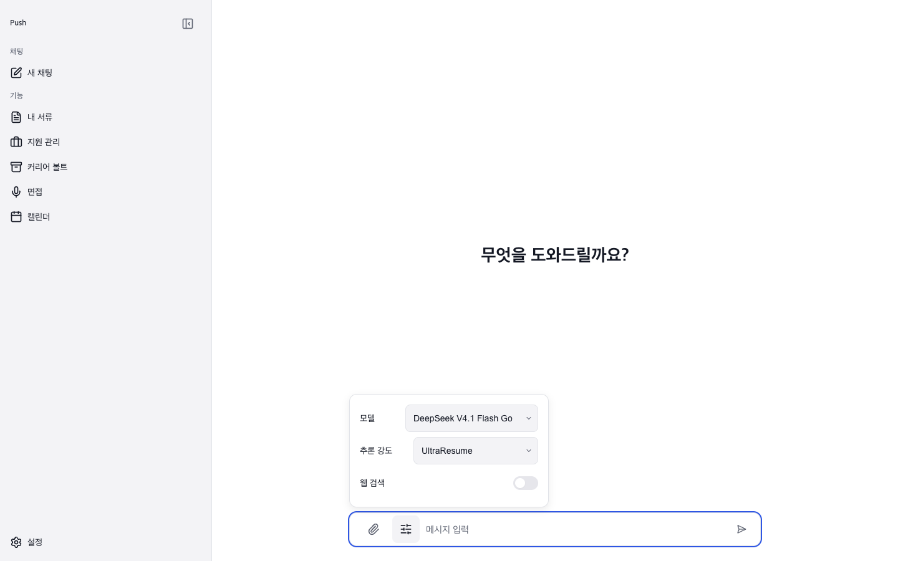 |
| 홈 컴포저 · 공고 URL + 이력서 첨부 | 추론 설정 · OpenCode Go DeepSeek v4.1 Flash |
|  | 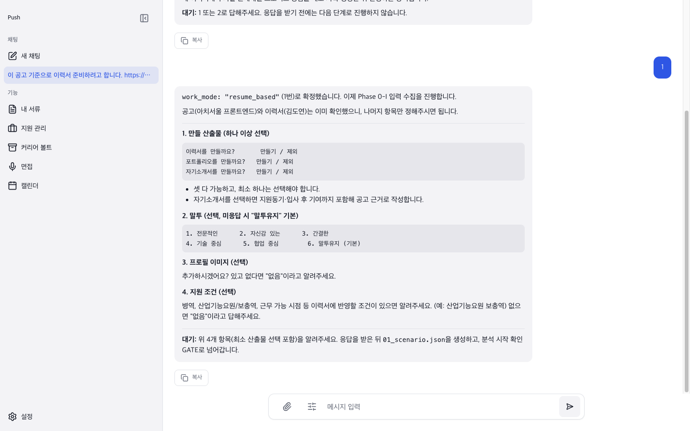 |
| 응답 스트리밍 | Phase 0 · 산출물 선택 게이트 |
|  | 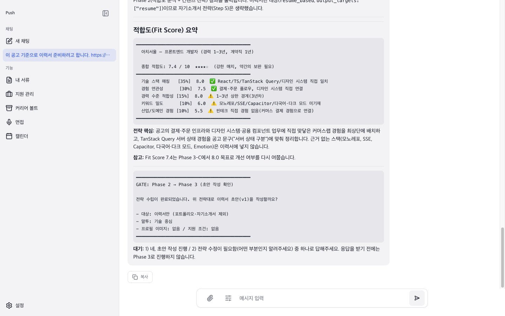 |
| Phase 2 · Fit score 게이트 | Phase 3 · 전략 게이트 |
| 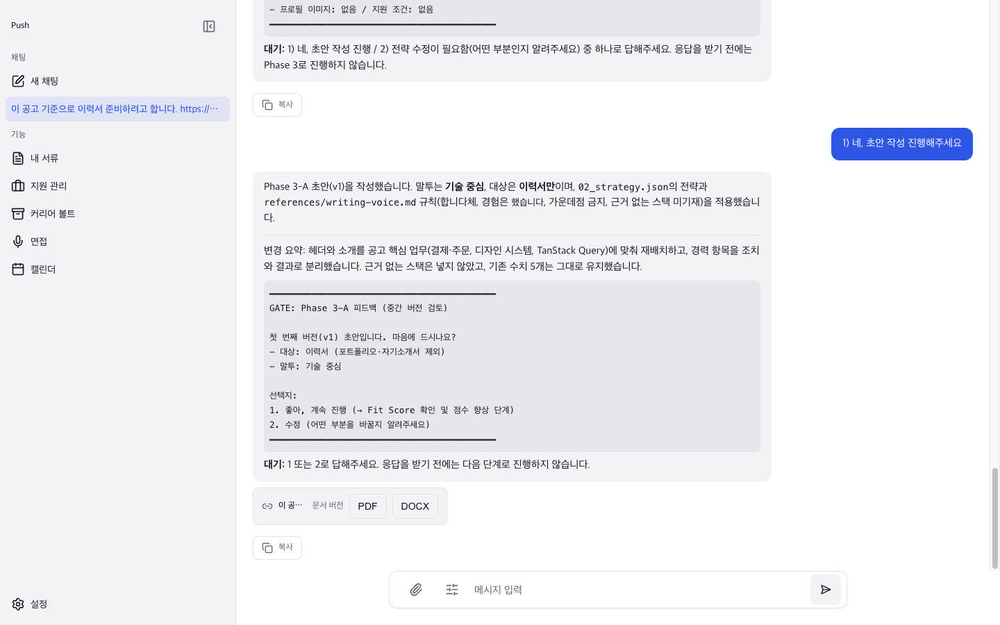 | 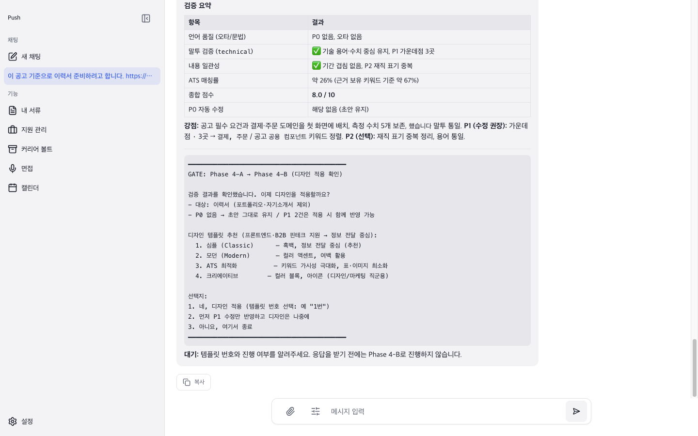 |
| Phase 4 · 초안 피드백 게이트 | Phase 5 · 템플릿 선택 게이트 |
| 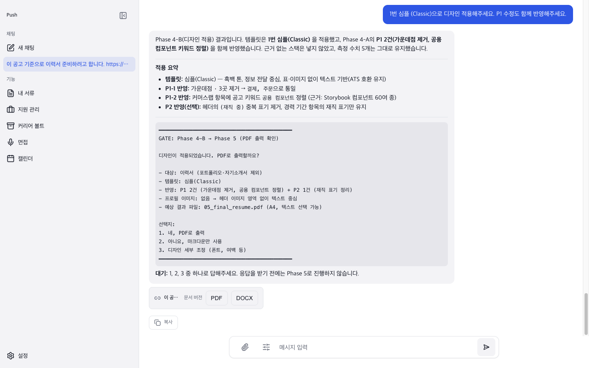 | 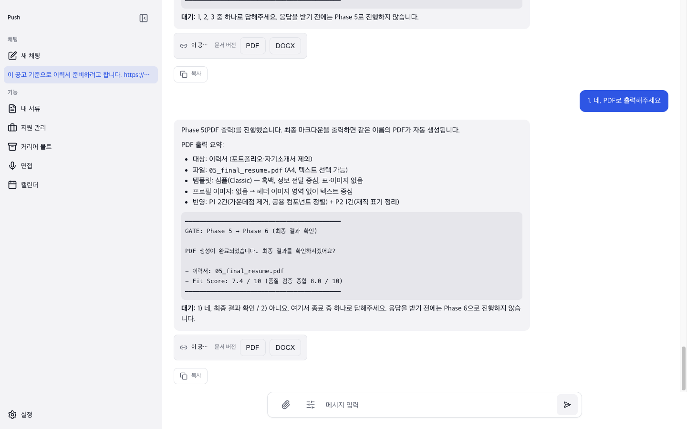 |
| Phase 6 · PDF 생성 게이트 | Phase 6 · 완료 게이트 |
|  |  |
| 페이지 이탈 후 복귀 · 스트림 자동 재연결 | 최종 응답 · 문서보내기 칩 |
| 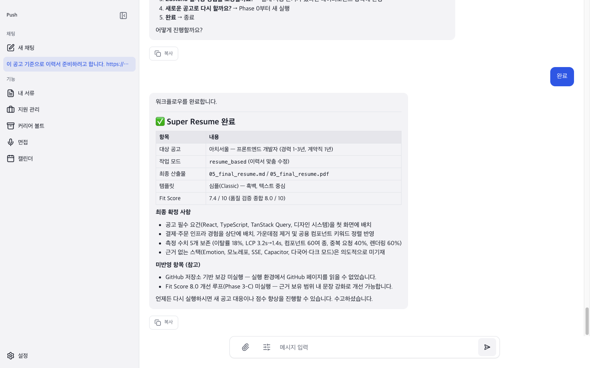 | 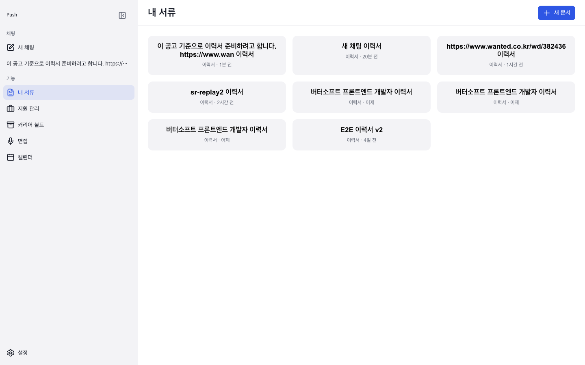 |
| 워크플로 완료 | 내 서류 목록 |
|  | 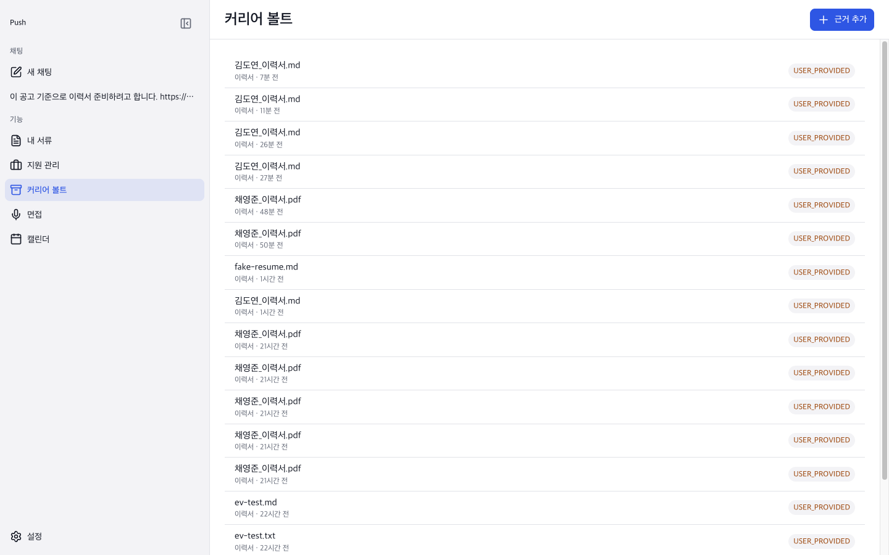 |
| 문서 편집기 · PDF/DOCX보내기 | 커리어 볼트 |
|  | 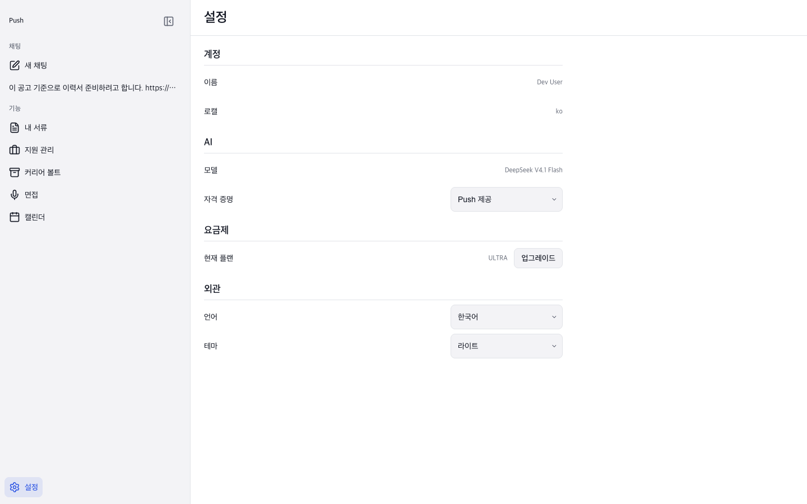 |
| 지원 관리 | 설정 |
| 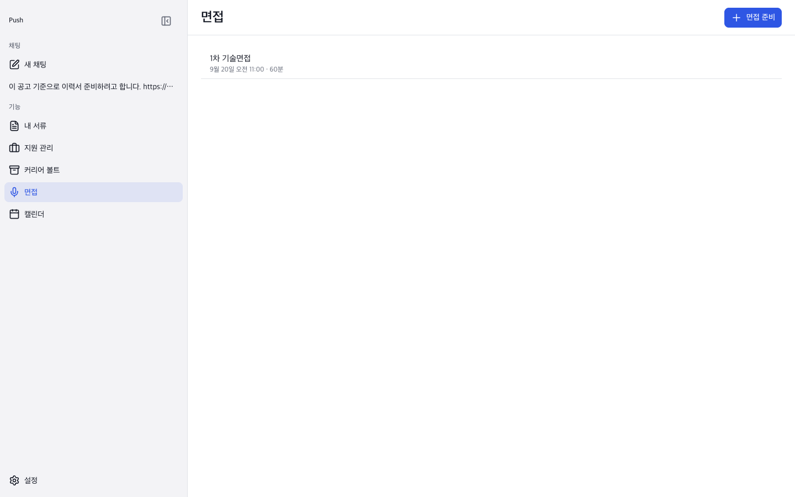 | |
| 면접 준비 | |

## Git 작업 규칙

`develop`에서 `feat|fix|refactor|chore|docs|test/<short-kebab-summary>` 브랜치를 만들고 작업 단위로 scoped Conventional Commit을 남긴다. PR은 `develop`을 대상으로 하며 검사 통과 후 squash merge한다.
