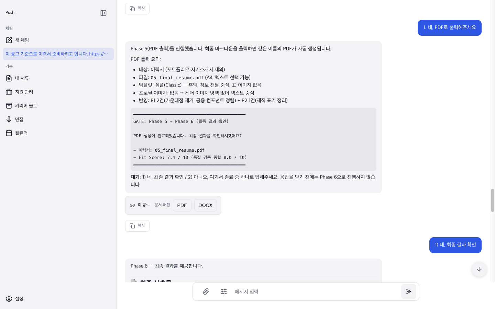
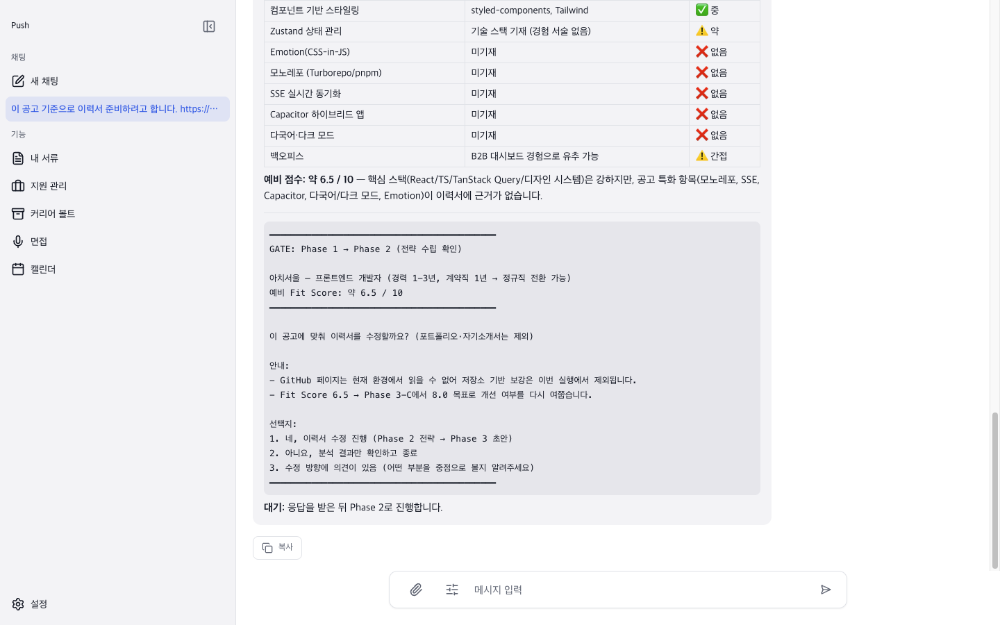
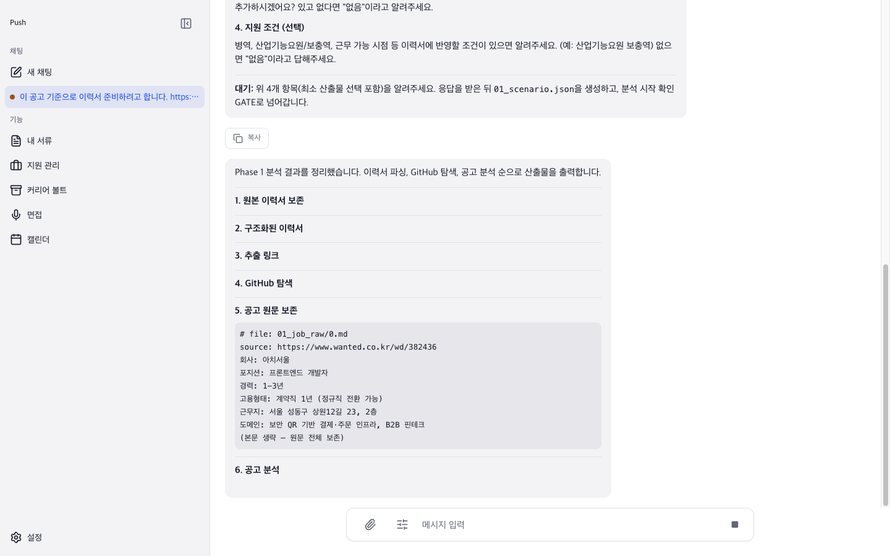
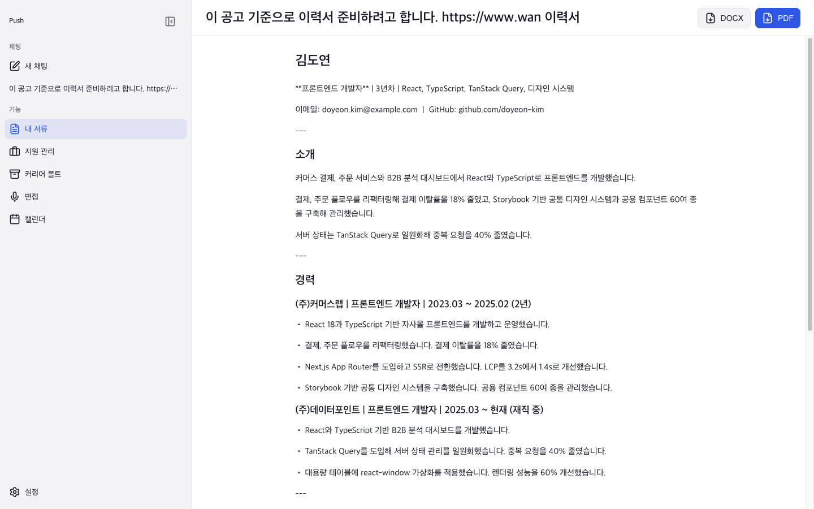
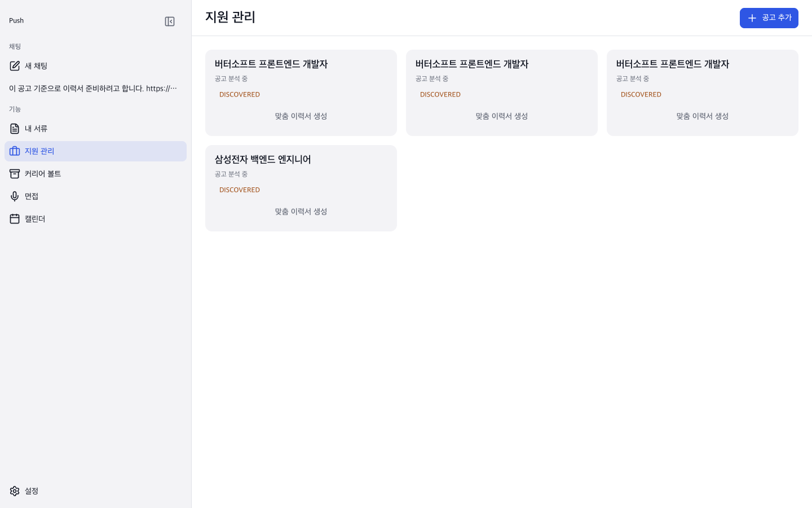
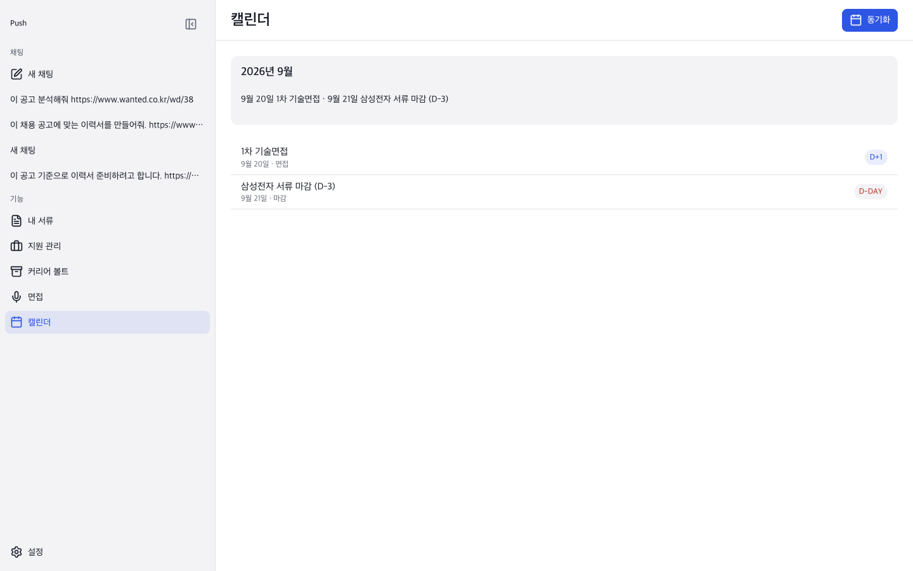

<h1 align="center">Push</h1>

<p align="center">
  <strong>근거 기반 커리어 작업공간 — 채용 공고를 넣으면 이력서·포트폴리오·자기소개서까지 단계별 게이트를 거쳐 만들어주는 AI 워크플로</strong>
</p>

<p align="center">
  
</p>

---

**Push**는 이력서를 "한 번에 생성"하지 않는다. 커리어 근거(이력서, GitHub, 프로젝트 기록)를 수집하고, 채용 공고를 분석하고, Fit score와 작성 전략을 세운 뒤, 단계마다 사람의 승인을 거쳐 최종 문서까지 만든다. AI가 만든 문장은 전부 사용자가 올린 근거에서 나온다.

## 왜 Push인가

| 문제 | 기존 방식 | Push |
| --- | --- | --- |
| AI 이력서가 과장되거나 지어냄 | 프롬프트 한 번에 완성본 요청 | 근거 청크를 pgvector로 검색해 주입, 없는 경험은 쓰지 않음 |
| 결과를 믿을 수 없음 | 결과만 보여줌 | Phase 0–6 구조적 게이트 — 각 단계를 보고 진행/수정 결정 |
| 공고마다 따로 관리 | 스프레드시트 수작업 | 공고 URL을 붙여넣으면 지원 항목이 자동 생성·연결 |
| 문서가 채팅에 묻힘 | 복사해서 별도 편집 | 생성물이 `내 서류` 문서로 동기화, PDF/DOCX로 보내기 |

## 주요 기능

- **단계별 워크플로** — 산출물 선택 → 근거 파싱 → 공고 분석 → Fit score → 전략 → 초안 → 품질 검증 → 템플릿 → PDF. 각 단계는 LangGraph interrupt 게이트로 사용자 승인을 받는다
- **근거 수집** — 이력서 파일 업로드, GitHub 리포 탐색, 채용 공고 URL fetch. 청크를 임베딩해 pgvector로 검색
- **끊기지 않는 스트림** — SSE로 토큰 스트리밍, 페이지를 나갔다 와도 진행 중 응답이 자동 재연결
- **역할별 모델 라우팅** — 생성/리서치/임베딩을 서로 다른 모델로 실행 (관리형·BYOK 모두 지원)
- **문서화** — 생성물을 `내 서류` 문서로 자동 동기화, TipTap 편집, PDF/DOCX보내기
- **지원 관리** — 공고 URL 감지 시 JobPosting + Application 자동 생성, 대화와 링크
- **커리어 볼트, 면접 준비, 프로젝트 기획서** — 이력서 외 산출물도 같은 근거에서 생성

## 스크린샷

가상 인물(김도연) 이력서로 실제 웹 UI에서 이력서 생성 전체 흐름을 돌린 화면. 나머지 화면은 [docs/screenshots](docs/screenshots/)에 있다.

| | |
| --- | --- |
|  |  |
| 홈 컴포저 · 공고 URL + 이력서 첨부 | Phase 게이트 · Fit score 확인 후 진행 |
|  |  |
| 페이지 이탈 후 복귀 · 스트림 자동 재연결 | 문서 편집기 · PDF/DOCX보내기 |
|  |  |
| 지원 관리 · 공고 URL로 자동 생성 | 캘린더 · Google 동기화 |

## 아키텍처

```
push-fe (Tauri v2 + React)          push-be (FastAPI + LangGraph)
┌─────────────────────────┐        ┌──────────────────────────────┐
│ Composer → SSE 스트림    │  HTTP  │ Router → ConversationService │
│ 게이트 응답 → 사용자 승인 │ ─────► │ → chat_jobs 큐 → 워커        │
│ TipTap 에디터            │  /api  │ → LangGraph (phase gates)    │
│ 문서/PDF·DOCX 다운로드   │        │ → pgvector 근거 검색         │
└─────────────────────────┘        └──────────┬───────────────────┘
                                              │ asyncpg
                                       PostgreSQL 16 + pgvector
```

| 경로 | 역할 |
| --- | --- |
| [push-fe](https://github.com/push-dot/push-fe) | Tauri v2 · React · ky · TanStack Query · Zustand · vanilla-extract · TipTap |
| [push-be](https://github.com/push-dot/push-be) | FastAPI · LangGraph · PostgreSQL API |
| [push-design](https://github.com/push-dot/push-design) | 디자인 시스템 — vanilla-extract 토큰·레시피·프리미티브 |
| [push-langdig](https://github.com/push-dot/push-langdig) | 랜딩 페이지 (Cloudflare Pages) |
